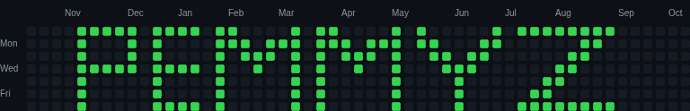

# js_githeatmap

## Start it now: https://pemmyz.github.io/js_githeatmap/

# 🎨 GitHub Contributions Heatmap Editor & Game Suite

Turn the classic GitHub contributions calendar/heatmap into a full-on pixel art editor, animation studio, and even a playable game console — all inside the browser.

- 🎨 Paint directly on a 53×7 "contribution heatmap" grid  
- 🎬 Animate it frame-by-frame, export GIF/PNGs/WEBP  
- 🧪 Import real CSV/JSON data and recolor it  
- 🧠 Auto-calculate levels (0–4) based on thresholds  
- 🎮 Built-in mini-games (Sideways Tetris + Snake) that run **inside** the grid  
- 🌗 Full dark/light GitHub-style theme with instant palette swap  
- 💾 Local persistence (autosaves to `localStorage`)

> **Tech stack:** HTML5 Canvas, vanilla JS, zero frameworks

---


## Heatmaps



## 🔥 Features

### 🖌 Heatmap Painter

- Pencil tool, rectangle fill, eraser, color picker  
- Adjustable brush mode:
  - **Set Level**: paint cells directly to level 0–4
  - **Add +N**: increment cell counts by any amount (+1, +5, etc.)
- Full undo / redo (`Ctrl+Z`, `Ctrl+Y`)
- Live total contribution counter

```json
{
  "dateISO": "2025-10-26",
  "count": 12,
  "level": 3
}
```

---

### 🎯 Tools Panel

- **Pencil (P)** — paint cells one at a time  
- **Rect Fill (R)** — drag to fill area  
- **Eraser (E)** — set cells to 0  
- **Picker (I)** — sample level/count  
- `G` key toggles grid

---

### 🎚 Thresholds & Levels

Editable logic for heatmap shading levels:

```js
function calculateLevel(count) {
  if (count === 0) return 0;
  if (count >= 13) return 4;
  if (count >= 8)  return 3;
  if (count >= 4)  return 2;
  if (count >= 1)  return 1;
  return 0;
}
```

---

### 🎨 Palette System

- 5-color palette for levels 0–4  
- Built-in presets:
  - Classic GitHub green
  - Dark GitHub
  - Neon/Arc
- Manual `<input type="color">` overrides  
- Auto palette switching with theme

---

### 🔄 Import / Export Real Data

- **JSON**: save/load full project
- **Layer JSON**: copy just one layer
- **CSV**: `date,count` format

```csv
2025-07-14,13
2025-07-15,5
2025-07-16,0
```

---

### 🖼 Image Legend (Overlay Stamp)

- Load external image as a grid brightness guide  
- Tune contrast & opacity  
- Stamp pixel data to layer (levels 0–4)

---

### 🔍 Zoom & Fit

- 100% / 150% / 200% / Fit Width
- Fully responsive layout

---

## 🗂 Layers

- Each frame has one or more named layers  
- Add/delete/switch layers  
- Each layer = separate grid

---

## 🎬 Animation System

- Timeline of frames (each with same layers)
- `+` new frame, 🗑️ delete, 📄 duplicate  
- Onion skin mode  
- FPS playback (1–30 FPS)  
- Stable month labels toggle  
- Auto-scroll generator

---

## ⏩ Frame Shifter

- Shift Up / Down / Left / Right  
- With **Wrap** and **Auto Animation**, auto-generates a scrolling marquee

- **Wrap:** When checked, any content moved off one edge of the canvas will wrap around and reappear on the opposite side.

- **Auto Wrap Animation:** When checked, pressing a shift arrow will automatically generate all the necessary frames to create a full, looping animation of the content scrolling across the canvas and returning to its starting position. This is perfect for creating smooth scrolling backgrounds or marquees from a single drawing.

---

## 📤 Export Options

- PNG / WEBP still  
- Frame-by-frame PNGs  
- Animated GIF  
- (Experimental) Animated WEBP  
- Export with/without date labels

---

## 🎮 Built-In Games

Toggle Game Mode (`T`) to play inside grid.

### Sideways Tetris

- Classic pieces (I, O, T, S, Z, J, L)
- Falls horizontally (right)
- Rotate: `A` / `ArrowLeft`
- Move: `WASD` or arrows
- Score by clearing vertical columns

```js
clearColumns() {
  let columnsCleared = 0;
  for (let c = GAME_COLS - 1; c >= 0; c--) {
    let full = true;
    for (let r = 0; r < GAME_ROWS; r++) {
      if (this.grid[r][c] === 0) { full = false; break; }
    }
    if (full) {
      columnsCleared++;
      for (let r = 0; r < GAME_ROWS; r++) {
        this.grid[r].splice(c, 1);
        this.grid[r].unshift(0);
      }
    }
  }
}
```

---

### Snake

- Move with `WASD` or arrows  
- Eat food, grow, avoid self/walls  
- Difficulty = speed  
- Uses palette level 4 for head, 3 for body

---

## 🌗 Themes

- ☀️ Light / 🌙 Dark toggle (`V`)
- Palette switches with theme
- Cells drawn with shading + highlight for clean look

---

## ⌨️ Keyboard Shortcuts

- `1–5`: Set brush level  
- `P / R / E / I`: Tools  
- `A`: Toggle brush mode (Set ↔ Add)  
- `G`: Grid  
- `V`: Theme  
- `T`: Game Mode  
- `Ctrl+Z / Y`: Undo / Redo  
- `Esc`: Close modals

---

## 🏗 Project Structure

```
.
├─ index.html
├─ style.css
├─ script.js         # Editor logic
├─ game.js           # Tetris + Snake
├─ gif.js            # GIF export
├─ gif.worker.js     # Web worker
├─ webp.js           # Experimental
└─ README.md
```

---

## 💾 Persistence

State saved to `localStorage`:

```js
localStorage.setItem('heatmapEditorState', JSON.stringify(state));
```

- Frames, layers, thresholds, palette  
- Restores on reload  
- `Reset to Default` wipes and reloads

---

## 🧠 Grid Dimensions

- 53 cols × 7 rows  
- `dateISO`, `count`, `level` stored per cell  
- Month and weekday labels drawn like GitHub

---

## 🚦 Browser Requirements

- Works offline in modern browser  
- No frameworks or dependencies  
- GIF export uses Web Worker (`gif.worker.js`)

---

## 📌 Roadmap / Ideas

- [ ] Gamepad support (press face button to join 💚)  
- [ ] Stable animated WEBP  
- [ ] Drag scrubbing in timeline  
- [ ] Copy/paste rectangle tool  
- [ ] Shareable presets  
- [ ] Real GitHub import via token (non-browser sandbox)

---

## 📄 License

MIT License.

> Create cursed animated GitHub snakes responsibly.

---

## 🤘 TL;DR

This lets you:

- Paint your own GitHub-style activity heatmap  
- Animate it frame-by-frame  
- Export GIFs / PNGs  
- Play games inside the grid  
- All in-browser — no backend

> It’s like MS Paint for your commit streaks.
